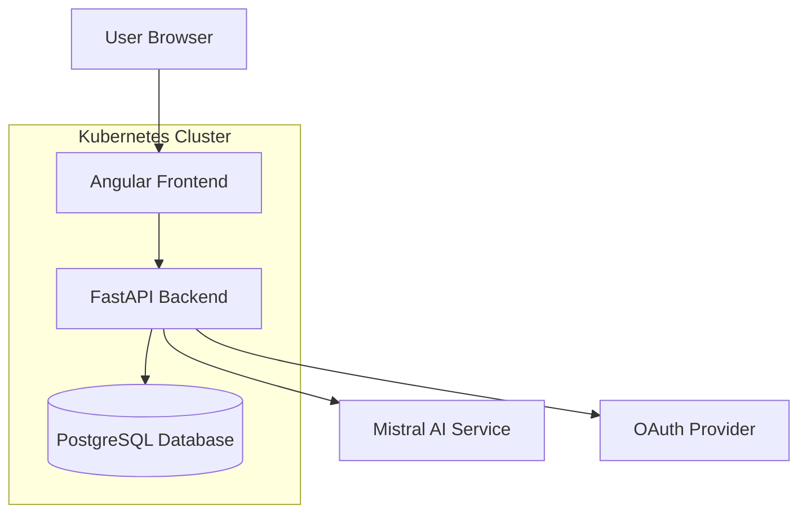
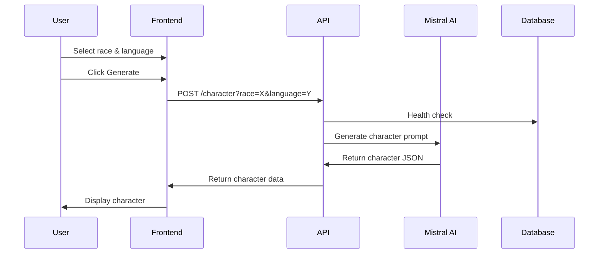

# Design Document

## Overview

Random JDR is a microservices-based web application that generates D&D characters using AI. The system follows a client-server architecture with a React-like Angular frontend communicating with a FastAPI backend. The backend integrates with Mistral AI for character generation and uses PostgreSQL for data persistence. The application is containerized and deployed using Kubernetes with Helm charts.

## Architecture

### High-Level Architecture



### Component Interaction Flow



## Components and Interfaces

### Frontend Components

#### AppComponent
- **Purpose**: Main application container and orchestration
- **Responsibilities**: 
  - Form management for race/language selection
  - Authentication state management
  - Character generation coordination
- **Dependencies**: ApiService, AuthOAuthService, FormBuilder
- **Interfaces**: 
  - Form controls for race and language selection
  - Character display integration

#### CharacterComponent
- **Purpose**: Display generated character information
- **Responsibilities**:
  - Render character details in a card layout
  - Handle character data presentation
- **Inputs**: Character object
- **UI Framework**: Angular Material cards

#### ToolbarComponent
- **Purpose**: Application navigation and branding
- **Responsibilities**: Display application header and navigation

### Backend Components

#### FastAPI Application (main.py)
- **Purpose**: HTTP API server and request handling
- **Responsibilities**:
  - Route handling for character generation
  - CORS configuration
  - Health check endpoints
  - Database session management
- **Endpoints**:
  - `GET /character` - Character generation
  - `GET /v1/liveness` - Liveness probe
  - `GET /v1/readiness` - Readiness probe
  - `GET /api/v1/db-check` - Database connectivity

#### Models (model.py)
- **Purpose**: Data structure definitions
- **Components**:
  - `Race` enum: Supported character races
  - `Languages` enum: Supported output languages
  - `Character` model: Character data structure

#### Configuration (config.py)
- **Purpose**: Application configuration management
- **Responsibilities**:
  - Environment variable handling
  - Database URL construction
  - LLM API configuration

### Services

#### ApiService (Frontend)
- **Purpose**: HTTP client for backend communication
- **Methods**:
  - `generateCharacter(race, language)`: Character generation API call
- **Configuration**: Environment-based API URL

#### AuthOAuthService (Frontend)
- **Purpose**: OAuth authentication management
- **Responsibilities**:
  - Login/logout flow
  - User session state
  - Authentication status tracking

## Data Models

### Character Interface (Frontend)
```typescript
interface Character {
  race: string;
  full_name: string;
  gender: string;
  description: string;
  attitude: string;
  loot: Loot[];
  quest: string;
}

interface Loot {
  name: string;
  description: string;
}
```

### Race Enum (Backend)
```python
class Race(str, Enum):
    DWARF = "dwarf"
    ELF = "elf"
    HALFLING = "halfling"
    HUMAN = "human"
    GNOME = "gnome"
    HALF_ORC = "half-orc"
```

### Languages Enum (Backend)
```python
class Languages(str, Enum):
    FRENCH = "french"
    ENGLISH = "english"
```

## Error Handling

### Frontend Error Handling
- **HTTP Errors**: Observable error handling in ApiService
- **Form Validation**: Reactive form validation for required fields
- **Authentication Errors**: OAuth service error handling
- **Network Errors**: User-friendly error messages for connectivity issues

### Backend Error Handling
- **Database Errors**: Try-catch blocks with logging and error responses
- **AI Service Errors**: Graceful handling of Mistral AI API failures
- **Validation Errors**: FastAPI automatic validation with proper error responses
- **Configuration Errors**: Environment variable validation at startup

### Logging Strategy
- **Backend**: Uvicorn logger for request/response logging
- **Error Tracking**: Structured logging for debugging
- **Health Monitoring**: Database connectivity logging

## Testing Strategy

### Frontend Testing
- **Unit Tests**: Jest with Angular testing utilities
- **Component Tests**: Isolated component testing with mocked dependencies
- **Service Tests**: HTTP client testing with mock backends
- **Integration Tests**: End-to-end user flow testing

### Backend Testing
- **Unit Tests**: Pytest for individual function testing
- **API Tests**: FastAPI TestClient for endpoint testing
- **Database Tests**: SQLAlchemy testing with test database
- **Integration Tests**: Full stack testing with test containers

### Test Data Management
- **Mock Data**: Predefined character responses for consistent testing
- **Test Database**: Isolated database for integration tests
- **AI Service Mocking**: Mock Mistral AI responses for predictable testing

## Deployment Architecture

### Containerization
- **Frontend**: Multi-stage Docker build with nginx serving static files
- **Backend**: Python container with FastAPI and dependencies
- **Database**: PostgreSQL container with persistent volumes

### Kubernetes Configuration
- **Helm Charts**: Templated Kubernetes manifests
- **ConfigMaps**: Environment-specific configuration
- **Secrets**: Sensitive data management (API keys, database credentials)
- **Services**: Load balancing and service discovery
- **Ingress**: External traffic routing

### Environment Management
- **Development**: Local Docker Compose setup
- **Staging**: Kubernetes cluster with staging configuration
- **Production**: Kubernetes cluster with production configuration and monitoring

## Security Considerations

### Authentication
- **OAuth Integration**: Secure authentication flow
- **Session Management**: Proper token handling and expiration
- **CORS Configuration**: Restricted origin access

### API Security
- **Input Validation**: FastAPI automatic validation
- **Rate Limiting**: Protection against abuse
- **Environment Variables**: Secure configuration management

### Data Security
- **Database Security**: Connection encryption and access controls
- **API Key Management**: Secure storage of Mistral AI credentials
- **Container Security**: Minimal base images and security scanning