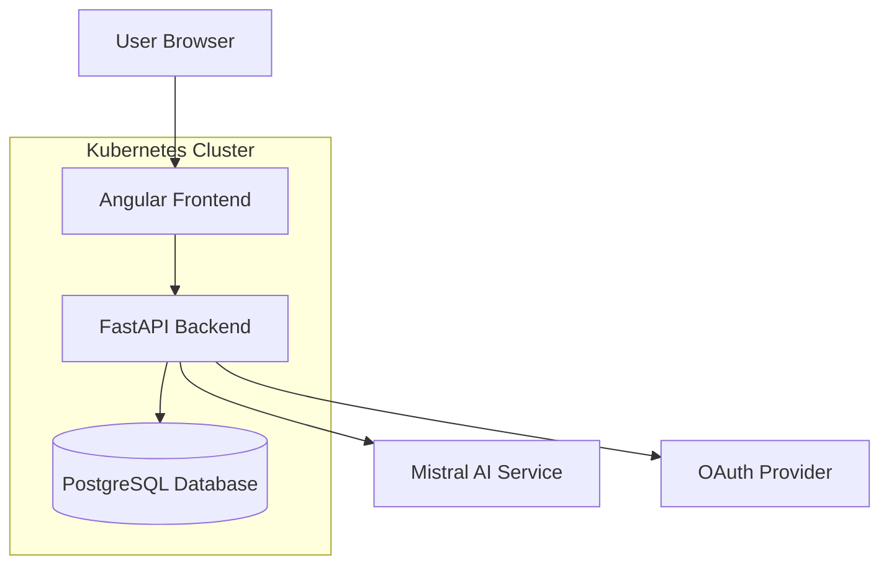
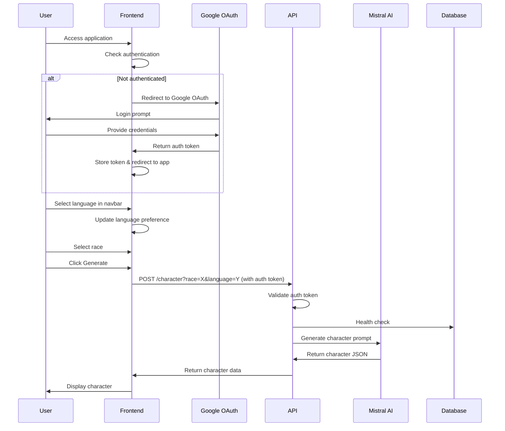

# Design Document

## Overview

Random JDR is a microservices-based web application that generates D&D characters using AI. The system follows a client-server architecture with a React-like Angular frontend communicating with a FastAPI backend. The backend integrates with Mistral AI for character generation and uses PostgreSQL for data persistence. The application is containerized and deployed using Kubernetes with Helm charts.

## Architecture

### High-Level Architecture



### Component Interaction Flow



## Components and Interfaces

### Frontend Components

#### AppComponent
- **Purpose**: Main application container and routing orchestration
- **Responsibilities**: 
  - Authentication state management
  - Route protection and navigation
  - Global application state
- **Dependencies**: AuthOAuthService, Router
- **Interfaces**: 
  - Authentication status monitoring
  - Route guard integration

#### NavbarComponent
- **Purpose**: Application navigation bar with language selection
- **Responsibilities**:
  - Display application branding and navigation
  - Language selector dropdown (French/English)
  - User authentication status display
  - Login/logout functionality
- **Dependencies**: AuthOAuthService, TranslateService
- **Interfaces**:
  - Language selection dropdown
  - User profile display
  - Authentication controls

#### LoginComponent
- **Purpose**: Authentication page for unauthenticated users
- **Responsibilities**:
  - Display login interface
  - Initiate Google OAuth2 flow
  - Handle authentication redirects
- **Dependencies**: AuthOAuthService
- **Route**: `/login`

#### CharacterGeneratorComponent
- **Purpose**: Main character generation interface
- **Responsibilities**: 
  - Form management for race selection
  - Character generation coordination
  - Display generated characters
- **Dependencies**: ApiService, FormBuilder
- **Interfaces**: 
  - Race selection form
  - Character display integration
- **Route**: `/generator` (protected)

#### CharacterComponent
- **Purpose**: Display generated character information
- **Responsibilities**:
  - Render character details in a card layout
  - Handle character data presentation
- **Inputs**: Character object
- **UI Framework**: Angular Material cards

### Backend Components

#### FastAPI Application (main.py)
- **Purpose**: HTTP API server and request handling
- **Responsibilities**:
  - Route handling for character generation
  - JWT token validation for protected endpoints
  - CORS configuration
  - Health check endpoints
  - Database session management
- **Endpoints**:
  - `GET /api/v1/character` - Character generation (protected)
  - `GET /v1/liveness` - Liveness probe
  - `GET /v1/readiness` - Readiness probe
  - `GET /api/v1/db-check` - Database connectivity

#### Authentication Middleware
- **Purpose**: JWT token validation and user authentication
- **Responsibilities**:
  - Validate Google OAuth2 JWT tokens
  - Extract user information from tokens
  - Protect API endpoints requiring authentication
- **Dependencies**: PyJWT, Google OAuth2 libraries

#### Models (model.py)
- **Purpose**: Data structure definitions
- **Components**:
  - `Race` enum: Supported character races
  - `Languages` enum: Supported output languages
  - `Character` model: Character data structure

#### Configuration (config.py)
- **Purpose**: Application configuration management
- **Responsibilities**:
  - Environment variable handling
  - Database URL construction
  - LLM API configuration

### Services

#### ApiService (Frontend)
- **Purpose**: HTTP client for backend communication
- **Methods**:
  - `generateCharacter(race, language)`: Character generation API call
- **Configuration**: Environment-based API URL
- **Authentication**: Includes auth token in request headers

#### AuthOAuthService (Frontend)
- **Purpose**: Google OAuth2 authentication management
- **Responsibilities**:
  - Google OAuth2 login/logout flow
  - JWT token storage and management
  - User session state tracking
  - Authentication status monitoring
- **Methods**:
  - `login()`: Initiate Google OAuth2 flow
  - `logout()`: Clear session and redirect
  - `isAuthenticated()`: Check authentication status
  - `getToken()`: Retrieve stored auth token

#### LanguageService (Frontend)
- **Purpose**: Application language management
- **Responsibilities**:
  - Language preference storage
  - Interface translation coordination
  - Language persistence across sessions
- **Dependencies**: TranslateService, LocalStorage
- **Methods**:
  - `setLanguage(lang)`: Update current language
  - `getLanguage()`: Get current language preference
  - `getSupportedLanguages()`: Return available languages

#### AuthGuard (Frontend)
- **Purpose**: Route protection service
- **Responsibilities**:
  - Protect routes requiring authentication
  - Redirect unauthenticated users to login
- **Dependencies**: AuthOAuthService, Router

## Routing Configuration

### Frontend Routes
```typescript
const routes: Routes = [
  { path: '', redirectTo: '/generator', pathMatch: 'full' },
  { path: 'login', component: LoginComponent },
  { 
    path: 'generator', 
    component: CharacterGeneratorComponent,
    canActivate: [AuthGuard]
  },
  { path: '**', redirectTo: '/generator' }
];
```

### Route Protection Strategy
- **Public Routes**: `/login` - Accessible without authentication
- **Protected Routes**: `/generator` - Requires valid authentication token
- **Default Behavior**: Unauthenticated users redirected to `/login`
- **Post-Login Redirect**: Authenticated users redirected to `/generator`

## Data Models

### Character Interface (Frontend)
```typescript
interface Character {
  race: string;
  full_name: string;
  gender: string;
  description: string;
  attitude: string;
  loot: Loot[];
  quest: string;
}

interface Loot {
  name: string;
  description: string;
}
```

### Race Enum (Backend)
```python
class Race(str, Enum):
    DWARF = "dwarf"
    ELF = "elf"
    HALFLING = "halfling"
    HUMAN = "human"
    GNOME = "gnome"
    HALF_ORC = "half-orc"
```

### Languages Enum (Backend)
```python
class Languages(str, Enum):
    FRENCH = "french"
    ENGLISH = "english"
```

## Error Handling

### Frontend Error Handling
- **HTTP Errors**: Observable error handling in ApiService
- **Form Validation**: Reactive form validation for required fields
- **Authentication Errors**: OAuth service error handling
- **Network Errors**: User-friendly error messages for connectivity issues

### Backend Error Handling
- **Database Errors**: Try-catch blocks with logging and error responses
- **AI Service Errors**: Graceful handling of Mistral AI API failures
- **Validation Errors**: FastAPI automatic validation with proper error responses
- **Configuration Errors**: Environment variable validation at startup

### Logging Strategy
- **Backend**: Uvicorn logger for request/response logging
- **Error Tracking**: Structured logging for debugging
- **Health Monitoring**: Database connectivity logging

## Testing Strategy

### Frontend Testing
- **Testing Framework**: Jest with `jest-preset-angular` (NOT Jasmine)
- **Unit Tests**: Jest with Angular testing utilities
- **Component Tests**: Isolated component testing with mocked dependencies using `jest.Mocked<T>` types
- **Service Tests**: HTTP client testing with mock backends
- **Integration Tests**: End-to-end user flow testing
- **Mock Strategy**: Use `jest.fn()` and `jest.Mocked<T>` for creating mocks instead of Jasmine spies
- **Test Configuration**: 
  - Jest config in `jest.config.js` with `jest-preset-angular`
  - Setup file at `setup-jest.ts` for global test configuration
  - Test commands: `npm test` or `ng test`

### Backend Testing
- **Unit Tests**: Pytest for individual function testing
- **API Tests**: FastAPI TestClient for endpoint testing
- **Database Tests**: SQLAlchemy testing with test database
- **Integration Tests**: Full stack testing with test containers

### Test Data Management
- **Mock Data**: Predefined character responses for consistent testing
- **Test Database**: Isolated database for integration tests
- **AI Service Mocking**: Mock Mistral AI responses for predictable testing

### Key Testing Differences from Jasmine
- Use `jest.fn()` instead of `jasmine.createSpy()`
- Use `jest.Mocked<T>` instead of `jasmine.SpyObj<T>`
- Use `mockFunction.mockReturnValue()` instead of `spy.and.returnValue()`
- Use `mockFunction.mockImplementation()` instead of `spy.and.callFake()`
- Use `expect.any(Object)` instead of `jasmine.any(Object)`
- Use `throwError(() => new Error())` for RxJS error testing

## Deployment Architecture

### Containerization
- **Frontend**: Multi-stage Docker build with nginx serving static files
- **Backend**: Python container with FastAPI and dependencies
- **Database**: PostgreSQL container with persistent volumes

### Kubernetes Configuration
- **Helm Charts**: Templated Kubernetes manifests
- **ConfigMaps**: Environment-specific configuration
- **Secrets**: Sensitive data management (API keys, database credentials)
- **Services**: Load balancing and service discovery
- **Ingress**: External traffic routing

### Environment Management
- **Development**: Local Docker Compose setup
- **Staging**: Kubernetes cluster with staging configuration
- **Production**: Kubernetes cluster with production configuration and monitoring

## Security Considerations

### Authentication
- **Google OAuth2 Integration**: Secure authentication flow using Google's OAuth2 service
- **JWT Token Management**: Proper token storage, validation, and expiration handling
- **Session Security**: Secure token storage in browser (httpOnly cookies or secure localStorage)
- **Token Validation**: Backend validation of Google OAuth2 JWT tokens on protected endpoints
- **CORS Configuration**: Restricted origin access for frontend-backend communication

### API Security
- **Protected Endpoints**: All character generation endpoints require valid authentication
- **Input Validation**: FastAPI automatic validation with Pydantic models
- **Rate Limiting**: Protection against abuse and excessive API calls
- **Environment Variables**: Secure configuration management for sensitive data
- **Request Authentication**: Bearer token authentication for API requests

### Data Security
- **Database Security**: Connection encryption and access controls
- **API Key Management**: Secure storage of Mistral AI credentials in environment variables
- **Container Security**: Minimal base images and security scanning
- **User Data Protection**: No persistent storage of user personal information beyond session
- **Google OAuth2 Compliance**: Adherence to Google's OAuth2 security best practices